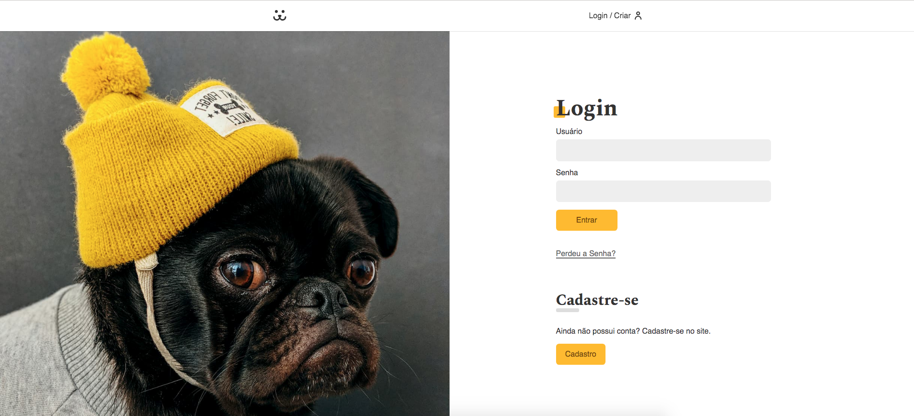

<h1 align="center">
  
Instadogs

  
</h1>

## Introdução

O Instadogs é um projeto com inspiração no instagram sendo somente para animais.

- **Simples de começar**

> Esse projeto é construído de forma que possa ser utilizado da forma mais prática possível. O projeto foi criado para praticar boas práticas, manuseio de dados e criação de formulários para login, cadastrar e alterar senhas de usuário.

- **Site**

> Para acessar o site clique no botão abaixo.

## Contato

- Linkedin:
  - [Alexandre Junior](https://www.linkedin.com/in/alexandrejuniorc/)
